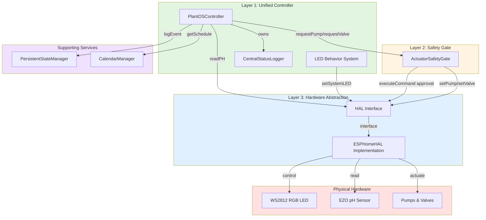

# Layer Interaction Diagram

This diagram shows how the three architectural layers interact with each other.

## Key Interactions

### Controller → SafetyGate
- **Purpose**: Request actuator operations with safety validation
- **Methods**: `requestPump()`, `requestValve()`, `turnOffAllPumps()`
- **Flow**: Controller requests → SafetyGate validates → HAL executes

### Controller → HAL
- **Purpose**: Direct sensor reading and LED control
- **Methods**: `readPH()`, `hasPhValue()`
- **Flow**: Controller reads → HAL wraps ESPHome component → returns value

### SafetyGate → HAL
- **Purpose**: Execute approved actuator commands
- **Methods**: `setPump()`, `setValve()`, `getPumpState()`
- **Flow**: SafetyGate approves → calls HAL → HAL wraps GPIO/PWM

### Controller → Services
- **Purpose**: Access scheduling and persistence
- **Methods**:
  - `Calendar::getTodaySchedule()` - Get pH targets and nutrient doses
  - `PSM::logEvent()` / `clearEvent()` - Crash recovery logging
- **Flow**: Controller queries/logs → Service provides data/persistence

## Benefits of This Architecture

1. **Hardware Independence**: Controller doesn't know about ESP32, works with any HAL
2. **Safety Enforcement**: All hardware access flows through validation
3. **Testability**: Mock HAL for unit tests without hardware
4. **Clear Responsibility**: Each layer has single, well-defined purpose
5. **Maintainability**: Hardware changes don't require controller changes
