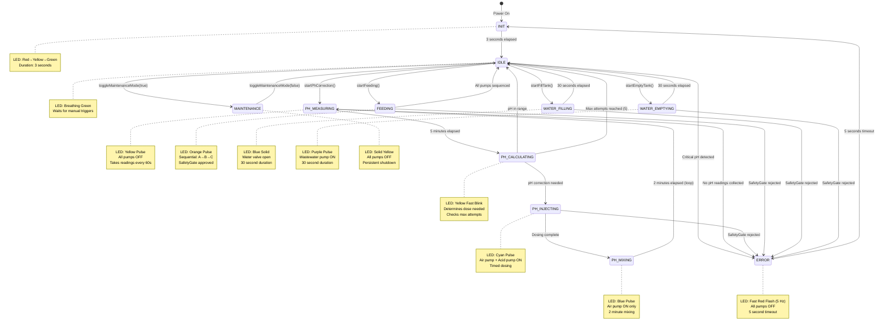

# FSM State Transition Diagram

This diagram shows all 12 states of the Unified Controller FSM and their transitions.



## State Descriptions

### INIT
- **Purpose**: Boot sequence with visual feedback
- **Duration**: 3 seconds
- **LED Pattern**: Red (0-1s) → Yellow (1-2s) → Green (2-3s)
- **Next State**: IDLE (automatic)

### IDLE
- **Purpose**: Ready state waiting for commands
- **Duration**: Indefinite
- **LED Pattern**: Breathing green (sine wave, 10-100% brightness)
- **Triggers**: Manual API calls (startPhCorrection, startFeeding, etc.)

### PH_MEASURING
- **Purpose**: Stabilize and collect pH readings
- **Duration**: 5 minutes (300 seconds)
- **LED Pattern**: Yellow pulse (0.5 Hz)
- **Actions**:
  - Turn off all pumps on entry
  - Collect pH reading every 60 seconds
  - Check for critical pH (< 5.0 or > 7.5)
- **Next State**: PH_CALCULATING (automatic) or ERROR (critical pH)

### PH_CALCULATING
- **Purpose**: Determine if pH correction needed
- **Duration**: Instantaneous (single loop iteration)
- **LED Pattern**: Yellow fast blink (2 Hz)
- **Logic**:
  - If pH in range (5.5-6.5) → IDLE
  - If max attempts (5) reached → IDLE
  - If correction needed → PH_INJECTING
- **Next State**: IDLE or PH_INJECTING

### PH_INJECTING
- **Purpose**: Dose acid to lower pH
- **Duration**: Calculated (based on pH difference) + 200ms margin
- **LED Pattern**: Cyan pulse (0.5 Hz)
- **Actions**:
  - Turn on air pump (mixing)
  - Turn on acid pump (via SafetyGate approval)
  - Wait for dose duration
  - Turn off acid pump
- **Next State**: PH_MIXING or ERROR (SafetyGate rejection)

### PH_MIXING
- **Purpose**: Mix acid into solution
- **Duration**: 2 minutes (120 seconds)
- **LED Pattern**: Blue pulse (0.5 Hz)
- **Actions**:
  - Keep air pump running
  - Wait for mixing duration
  - Turn off air pump
- **Next State**: PH_MEASURING (loop for verification)

### FEEDING
- **Purpose**: Sequential nutrient dosing
- **Duration**: Variable (sum of A + B + C durations)
- **LED Pattern**: Orange pulse (0.5 Hz)
- **Actions**:
  - Activate Pump A (via SafetyGate), wait
  - Activate Pump B (via SafetyGate), wait
  - Activate Pump C (via SafetyGate), wait
- **Next State**: IDLE or ERROR (SafetyGate rejection)

### WATER_FILLING
- **Purpose**: Add fresh water to tank
- **Duration**: 30 seconds
- **LED Pattern**: Blue solid
- **Actions**:
  - Open water valve (via SafetyGate)
  - Wait 30 seconds + 200ms margin
  - Close water valve
- **Next State**: IDLE or ERROR (SafetyGate rejection)

### WATER_EMPTYING
- **Purpose**: Remove wastewater from tank
- **Duration**: 30 seconds
- **LED Pattern**: Purple pulse (0.5 Hz)
- **Actions**:
  - Turn on wastewater pump (via SafetyGate)
  - Wait 30 seconds + 200ms margin
  - Turn off wastewater pump
- **Next State**: IDLE or ERROR (SafetyGate rejection)

### MAINTENANCE
- **Purpose**: Persistent shutdown for manual intervention
- **Duration**: Indefinite (until user exits)
- **LED Pattern**: Solid yellow
- **Actions**:
  - Turn off all pumps on entry
  - Log shutdown state to PSM (persistent)
  - Update StatusLogger
- **Next State**: IDLE (manual via toggleMaintenanceMode)

### ERROR
- **Purpose**: Safety state for critical conditions
- **Duration**: 5 seconds
- **LED Pattern**: Fast red flash (5 Hz)
- **Actions**:
  - Turn off all pumps on entry
  - Clear alerts after timeout
- **Next State**: INIT (automatic recovery)

## State Handler Implementation

All state handlers follow this pattern:

```cpp
void PlantOSController::handleStateName() {
    uint32_t elapsed = getStateElapsed();

    // Entry logic (elapsed < 100ms)
    if (elapsed < 100) {
        // One-time setup: turn on/off actuators, log events
    }

    // Periodic logic (if needed)
    // Check elapsed time and perform actions

    // Exit logic
    if (elapsed >= DURATION) {
        // Cleanup and transition to next state
        transitionTo(NextState);
    }
}
```

## Critical Paths

### pH Correction Loop
```
PH_MEASURING → PH_CALCULATING → PH_INJECTING → PH_MIXING → PH_MEASURING
                     ↓                                          ↑
                   IDLE ←───────────────────────────────────────┘
                   (if in range or max attempts)
```

### Error Recovery
```
Any State → ERROR → INIT → IDLE
            (critical condition)  (5s timeout)  (3s boot)
```

### Maintenance Mode
```
IDLE ⇄ MAINTENANCE
     (toggleMaintenanceMode)
```
