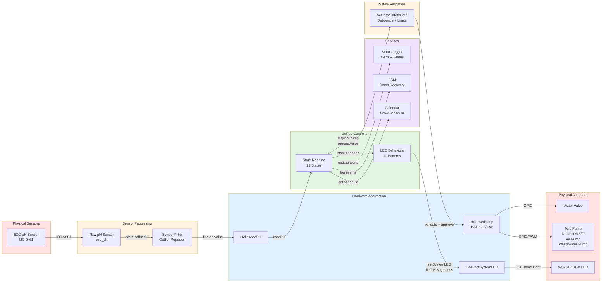

# Data Flow Diagram

This diagram shows how data flows through the system from sensors to actuators.



## Data Flow Paths

### 1. Sensor Reading Path (Input)

```
pH Sensor (I2C 0x61)
  ↓ ASCII text response (300ms delay)
Raw pH Sensor Component (ezo_ph)
  ↓ state callback on update
Sensor Filter (outlier rejection)
  ↓ filtered value (robust average)
HAL::readPH()
  ↓ return filtered value
Controller State Handler
  ↓ decision making
Action (transition state, dose acid, etc.)
```

**Key Points**:
- EZO pH sensor uses ASCII protocol (not binary registers)
- 300ms delay required after write before reading
- Sensor filter rejects top/bottom 10% outliers
- HAL wraps ESPHome sensor component
- Controller reads on-demand (no callbacks in controller)

### 2. Actuator Control Path (Output)

```
Controller State Handler
  ↓ requestPump("AcidPump", true, 10)
ActuatorSafetyGate
  ↓ validate: debounce, duration limit, runtime
  ↓ [APPROVED] or [REJECTED + log violation]
HAL::setPump("AcidPump", true)
  ↓ GPIO/PWM control
Physical Pump
```

**Safety Checkpoints**:
1. **Controller**: State machine logic (only request pumps in valid states)
2. **SafetyGate**: Hardware safety (max duration, debouncing, soft-start)
3. **HAL**: Hardware abstraction (prevents direct GPIO access)

### 3. LED Feedback Path (Visual Output)

```
Controller::transitionTo(NEW_STATE)
  ↓ state change triggers LED behavior update
LedBehaviorSystem::update(state, elapsed, hal)
  ↓ lookup behavior for current state
Specific LED Behavior (e.g., BreathingGreen)
  ↓ calculate R, G, B, brightness based on elapsed time
HAL::setSystemLED(0.0, 1.0, 0.0, brightness)
  ↓ ESPHome Light component make_call()
WS2812 RGB LED
```

**LED Update Frequency**: ~1000 Hz for smooth animations

### 4. Service Integration Paths

#### Calendar Manager (Read)
```
Controller::handlePhCalculating()
  ↓ need pH targets for today
Calendar::getTodaySchedule()
  ↓ query NVS for current day
  ↓ return DailySchedule struct
Controller
  ↓ compare pH with target_ph_min/max
Decision (inject acid or return to IDLE)
```

#### Persistent State Manager (Write)
```
Controller::startPhCorrection()
  ↓ beginning critical operation
PSM::logEvent("PH_CORRECTION", 0)
  ↓ write to NVS with timestamp
[Power loss or crash]
  ↓ on reboot
PSM::wasInterrupted(60)
  ↓ check if event < 60 seconds old
Controller::setup()
  ↓ recovery action (return to safe state)
```

#### Central Status Logger (Monitoring)
```
Controller::handleError()
  ↓ critical condition detected
StatusLogger::updateAlert("PH_CRITICAL", "pH out of range")
  ↓ add to active alerts vector
StatusLogger::logStatus() [every 30s]
  ↓ print structured report to serial
Serial Output
  ↓ user monitoring via logs
```

## Data Structures

### DailySchedule (Calendar)
```cpp
struct DailySchedule {
    uint8_t day_number;                 // 1-120
    float target_ph_min;                // 5.5
    float target_ph_max;                // 6.5
    uint32_t nutrient_A_duration_ms;    // 5000
    uint32_t nutrient_B_duration_ms;    // 4000
    uint32_t nutrient_C_duration_ms;    // 3000
};
```

### CriticalEventLog (PSM)
```cpp
struct CriticalEventLog {
    char eventID[32];       // "PH_CORRECTION"
    int64_t timestampSec;   // Unix timestamp
    int32_t status;         // 0=STARTED, 1=COMPLETED, 2=ERROR
};
```

### Alert (StatusLogger)
```cpp
struct Alert {
    std::string type;        // "PH_CRITICAL"
    std::string reason;      // "pH out of safe range"
    uint32_t timestamp;      // millis() when triggered
};
```

## Timing Characteristics

### Update Frequencies

| Component | Update Rate | Purpose |
|-----------|-------------|---------|
| Controller loop | ~1000 Hz | State machine dispatch |
| LED behaviors | ~1000 Hz | Smooth animations |
| pH sensor | 5 seconds | ESPHome update_interval |
| Sensor filter | 5 seconds | Matches sensor rate |
| SafetyGate ramping | ~100 Hz | Soft-start PWM |
| StatusLogger | 30 seconds | Periodic reports |
| Calendar queries | On-demand | Only when needed |
| PSM writes | On-demand | Critical events only |

### Critical Timing

| Operation | Duration | Reason |
|-----------|----------|--------|
| INIT boot sequence | 3 seconds | Visual feedback |
| PH_MEASURING | 5 minutes | pH stabilization |
| PH_MIXING | 2 minutes | Thorough mixing |
| ERROR timeout | 5 seconds | User awareness |
| Safety margin | 200 ms | Actuator stop delay |
| I2C read delay (EZO) | 300 ms | Hardware requirement |

## Non-Blocking Design

All components use non-blocking timing:

```cpp
// BAD: Blocks entire system
delay(1000);

// GOOD: Non-blocking check
uint32_t elapsed = millis() - start_time_;
if (elapsed >= 1000) {
    // Take action
}
```

This ensures:
- WiFi stays connected
- OTA updates work
- Serial logging continues
- LED animations stay smooth
- System remains responsive
