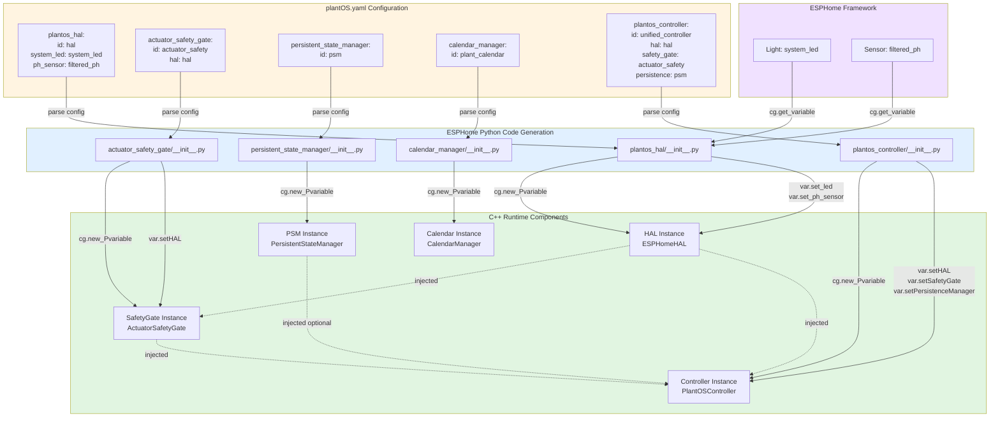

# Dependency Injection Diagram

This diagram shows how dependencies are injected throughout the PlantOS architecture.



## Dependency Injection Flow

### Step 1: YAML Configuration

User defines components in `plantOS.yaml`:

```yaml
# Layer 3: HAL
plantos_hal:
  id: hal
  system_led: system_led       # Reference to ESPHome light
  ph_sensor: filtered_ph_sensor # Reference to ESPHome sensor

# Layer 2: Safety Gate
actuator_safety_gate:
  id: actuator_safety
  hal: hal                      # Dependency injection
  acid_pump_max_duration: 30

# Services
persistent_state_manager:
  id: psm

calendar_manager:
  id: plant_calendar

# Layer 1: Unified Controller
plantos_controller:
  id: unified_controller
  hal: hal                      # Required dependency
  safety_gate: actuator_safety  # Required dependency
  persistence: psm              # Optional dependency
```

### Step 2: Python Code Generation

ESPHome processes each component's `__init__.py`:

#### plantos_hal/__init__.py
```python
async def to_code(config):
    var = cg.new_Pvariable(config[CONF_ID])
    await cg.register_component(var, config)

    # Inject LED dependency
    led = await cg.get_variable(config['system_led'])
    cg.add(var.set_led(led))

    # Inject pH sensor dependency
    ph = await cg.get_variable(config['ph_sensor'])
    cg.add(var.set_ph_sensor(ph))
```

#### actuator_safety_gate/__init__.py
```python
async def to_code(config):
    var = cg.new_Pvariable(config[CONF_ID])
    await cg.register_component(var, config)

    # Inject HAL dependency
    hal = await cg.get_variable(config['hal'])
    cg.add(var.setHAL(hal))

    # Set max durations
    cg.add(var.set_acid_pump_max_duration(config['acid_pump_max_duration']))
```

#### plantos_controller/__init__.py
```python
async def to_code(config):
    var = cg.new_Pvariable(config[CONF_ID])
    await cg.register_component(var, config)

    # Inject required HAL dependency
    hal = await cg.get_variable(config['hal'])
    cg.add(var.setHAL(hal))

    # Inject required SafetyGate dependency
    gate = await cg.get_variable(config['safety_gate'])
    cg.add(var.setSafetyGate(gate))

    # Inject optional PSM dependency
    if CONF_PERSISTENCE in config:
        psm = await cg.get_variable(config[CONF_PERSISTENCE])
        cg.add(var.setPersistenceManager(psm))
```

### Step 3: C++ Setter Methods

Each component provides setter methods for dependency injection:

#### plantos_hal/hal.h
```cpp
class ESPHomeHAL : public HAL {
public:
    void set_led(esphome::light::LightState* led) {
        led_ = led;
    }

    void set_ph_sensor(esphome::sensor::Sensor* ph) {
        ph_sensor_ = ph;
    }

private:
    esphome::light::LightState* led_{nullptr};
    esphome::sensor::Sensor* ph_sensor_{nullptr};
};
```

#### actuator_safety_gate/ActuatorSafetyGate.h
```cpp
class ActuatorSafetyGate : public Component {
public:
    void setHAL(plantos_hal::HAL* hal) {
        hal_ = hal;
    }

private:
    plantos_hal::HAL* hal_{nullptr};
};
```

#### plantos_controller/controller.h
```cpp
class PlantOSController : public Component {
public:
    // Required dependencies
    void setHAL(plantos_hal::HAL* hal) {
        hal_ = hal;
    }

    void setSafetyGate(actuator_safety_gate::ActuatorSafetyGate* gate) {
        safety_gate_ = gate;
    }

    // Optional dependencies
    void setPersistenceManager(persistent_state_manager::PersistentStateManager* psm) {
        psm_ = psm;
    }

private:
    plantos_hal::HAL* hal_{nullptr};
    actuator_safety_gate::ActuatorSafetyGate* safety_gate_{nullptr};
    persistent_state_manager::PersistentStateManager* psm_{nullptr};

    // Owned (not injected)
    CentralStatusLogger status_logger_;
};
```

### Step 4: Runtime Usage

Controller uses injected dependencies:

```cpp
void PlantOSController::handlePhMeasuring() {
    // Check dependencies
    if (!hal_ || !safety_gate_) {
        ESP_LOGE(TAG, "Dependencies not injected!");
        return;
    }

    // Use HAL to read sensor
    if (hal_->hasPhValue()) {
        float ph = hal_->readPH();
        ph_readings_.push_back(ph);
    }

    // Use optional PSM (null check)
    if (psm_) {
        psm_->logEvent("PH_MEASURING", 0);
    }

    // Use SafetyGate to control actuators
    safety_gate_->executeCommand("AirPump", false, 0);
}
```

## Dependency Types

### Required Dependencies
- **Enforced by**: Python `cv.Required()` in CONFIG_SCHEMA
- **Runtime check**: `if (!dependency_)` at start of methods
- **Examples**:
  - Controller requires HAL
  - Controller requires SafetyGate
  - SafetyGate requires HAL

### Optional Dependencies
- **Enforced by**: Python `cv.Optional()` in CONFIG_SCHEMA
- **Runtime check**: `if (dependency_)` before use
- **Examples**:
  - Controller optionally uses PSM (works without it)
  - Controller optionally uses Calendar (future)

### Owned Dependencies
- **Not injected**: Created/owned by component itself
- **Lifetime**: Managed by owning component
- **Examples**:
  - Controller owns CentralStatusLogger
  - Controller owns LedBehaviorSystem

## Benefits of Dependency Injection

### 1. Testability
```cpp
// Production: Real HAL
PlantOSController controller;
ESPHomeHAL real_hal(led, sensor);
controller.setHAL(&real_hal);

// Testing: Mock HAL
PlantOSController controller;
MockHAL mock_hal;
controller.setHAL(&mock_hal);
// Now test controller logic without hardware
```

### 2. Flexibility
- Easy to swap implementations (e.g., different HAL for different hardware)
- Components don't need to know about concrete types
- Loose coupling between layers

### 3. Clear Dependencies
- Dependencies explicit in YAML configuration
- Easy to see what each component needs
- Build-time validation of dependency graph

### 4. Lifecycle Management
- ESPHome framework manages component lifecycle
- setup() called in dependency order
- loop() called for all components

## Dependency Graph

```
┌─────────────────────────────────────────┐
│ ESPHome Framework Components            │
│ - light::LightState (system_led)        │
│ - sensor::Sensor (filtered_ph_sensor)   │
└────────────┬────────────────────────────┘
             │
             ▼
┌─────────────────────────────────────────┐
│ Layer 3: HAL                            │
│ Dependencies: LED, pH Sensor            │
└────────────┬────────────────────────────┘
             │
             ▼
┌─────────────────────────────────────────┐
│ Layer 2: ActuatorSafetyGate             │
│ Dependencies: HAL                       │
└────────────┬────────────────────────────┘
             │
             ▼
┌─────────────────────────────────────────┐
│ Layer 1: PlantOSController              │
│ Required: HAL, SafetyGate               │
│ Optional: PSM, Calendar                 │
│ Owned: StatusLogger, LedBehaviors       │
└─────────────────────────────────────────┘
```

Dependencies flow bottom-up: lower layers have fewer dependencies, upper layers depend on lower layers.

## Error Handling

### Missing Required Dependency
```cpp
void PlantOSController::loop() {
    if (!hal_ || !safety_gate_) {
        // Early return - don't execute
        return;
    }
    // Normal operation
}
```

### Missing Optional Dependency
```cpp
void PlantOSController::startPhCorrection() {
    // Use if available
    if (psm_) {
        psm_->logEvent("PH_CORRECTION", 0);
    }
    // Continue regardless
    transitionTo(ControllerState::PH_MEASURING);
}
```

### Build-Time Validation
ESPHome validates dependency graph during build:
- References to non-existent IDs fail compilation
- Type mismatches detected (e.g., passing wrong component type)
- Circular dependencies prevented
